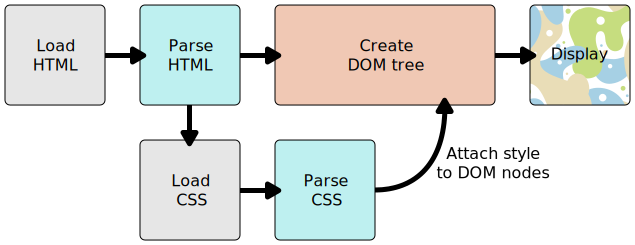

# Front-End Development Learning Guide
From Zero to Front-end Hero

Author Info
-----------
Author: Andrew Gurung <br>
URL: http://www.andrewgurung.com/

Context
-----------------
## CSS Basics from Mozilla Developer Network <br/>
https://developer.mozilla.org/en-US/docs/Learn/CSS/Introduction_to_CSS/How_CSS_works

Notes
-----
### Introduction to CSS

#### CSS basics
- A document is usually a text file structured using a markup language — `HTML`
- CSS is a language for specifying how documents are presented to users

**CSS consists of:**
- property: how to display the element
- selector: which elements to apply the properties to

**Simple CSS Syntax**

[JS Bin Example](https://jsbin.com/lapocar/edit?html,css,output)

HTML:
```
<!DOCTYPE html>
<html>
  <head>
    <meta charset="utf-8">
    <title>My CSS experiment</title>
    <link rel="stylesheet" href="style.css">
  </head>
  <body>
    <h1>Hello World!</h1>
    <p>This is my first CSS example</p>
  </body>
</html>
```

CSS:
```
h1 {
  color: blue;
  background-color: yellow;
  border: 1px solid black;
}

p {
  color: red;
}
```

#### How does CSS work


#### DOM
- DOM has a tree-like structure
- Each element, attribute and piece of text becomes a DOM node

#### Ways to apply CSS
1. External stylesheet
```
<head>
   <title>My CSS experiment</title>
   <link rel="stylesheet" href="style.css">
 </head>
```
2. Internal stylesheet
```
<head>
   <title>My CSS experiment</title>
   <style>
     p {
       color: red;
     }
   </style>
 </head>
```
3. Inline stylesheet
```
<body>
    <p style="color:red;">This is my first CSS example</p>
  </body>
```

#### CSS Vocabulary
CSS consists of two building blocks:
- property: Human-readable identifiers that indicates which stylistic feature to change
- value: How you want to change those stylistic features

```
Property + Value ==> CSS Declaration

CSS Declaration + Selectors ==> CSS Rulesets/Rules
```

- There are around 300 CSS properties

#### CSS Declaration block
- Enclosed in braces `{ }`
- Must end with semicolons
- Best practice: leave the last property with `;` too so that you don't forget
```
{
  background-color: red;
  color: blue
}
```

#### CSS At-rules and Nested Statements

CSS Rules are the most common blocks in CSS. But there are other blocks/statements too.
1. At-rules:
  - Used to convey metadata, nested or descriptive information
  - Starts with `@` sign, then followed by syntax, ending with `;`
  - Eg: `@import`(metadata), `@media`(nested), `@font-face`(descriptive)

2. Nested Statements:
  - Subset of At-rule
  - Syntax is a nested block of CSS which applies only if the condition is met
  ```
  @media(min-width: 800px) {
    body {
      color: red;
    }
  }
  ```

#### Making CSS readable
1. Whitespace
- Browsers ignores CSS whitespaces(tabs, spaces, new lines) as in HTML

2. Comment
- Comments in CSS begin with `/* and end with */`

3. Shorthand
```
padding-top: 10px;
padding-right: 15px;
padding-bottom: 15px;
padding-left: 5px;
```

Shorthand properties
```
/* in shorthand like padding and margin, the values are applied
   in the order top, right, bottom, left (the same order as an analog clock). There are also other
   shorthand types, for example two values, which set for example
   the padding for top/bottom, then left/right */
padding: 10px 15px 15px 5px;
```

#### Types of CSS selector
The following  types of CSS selectors are based on:
1. Simple selector: Element type, class or id
2. Attribute selector: Attributes/attribute values
3. Pseudo-classes: State an element exist in. Eg: Mouse hovered
4. Pseudo-elements: Relative to an element. Eg: First word of every paragraph
5. Combinators: Combining two or more selectors. Eg: Paragraphs that are direct descendants of divs
6. Multiple selectors: Multiple selectors share the same CSS rule separated by comma


#### Simple selectors
1. Element selector
- Selects an HTML element
- Case in-sensitive

HTML:
```
<div>CSS simple selctor</div>
```
CSS:
```
DIV {
  color: blue;
}
```  

2. Class selector
- '.' followed by class name
- Multiple elements can share same class name

HTML:
```
<li class="first done">Milk</li>
<li class="second done">Eggs</li>
```

CSS:
```
.done {
  text-decoration: line-through;
}
```

3. ID selector
- '#' followed by ID name of an element
- Most efficient way to select a single element

HTML:
```
<p id="polite"> — "Good morning."</p>
```

CSS:
```
#polite {
  font-family: cursive;
}
```

4. Universal selector
- `*`
- Rarely useful as it selects all elements

5. Combinators using simple selectors
- The descendant selector: (space) -- Select an element nested somewhere inside another element (not necessarily a direct descendant)
- The child selector: `>` -- Select an element that is an immediate child of another element.
- The adjacent sibling selector: `+` -— Select an element that is an immediate sibling of another element (i.e. right next to it, at the same level in the hierarchy).
- The general sibling selector: `~` —- allows you to select any elements that are siblings of another element (i.e. at the same level in the hierarchy, but not necessarily right next to it)

HTML:
```
<section>
  <h2>Heading 1</h2>
  <p>Paragraph 1</p>
  <p>Paragraph 2</p>
  <div>
    <h2>Heading 2</h2>
    <p>Paragraph 3</p>
    <p>Paragraph 4</p>
  </div>
</section>
```

CSS:
```
section p {
  color: blue;
}

section > p {
  background-color: yellow;
}

h2 + p {
  text-transform: UPPERCASE;
}

h2 ~ p {
  border: 1px dashed black;
}
```

[JSBin Practice](https://jsbin.com/kuyasu/2/edit?html,css,output)


#### Attribute selectors
1. Presence and value attribute selectors
- Tries to match exact attribute value

**Types:**
- [attr]: All matching attributes `attr`
- [attr="val"]: Matching attributes where `val` is the `attr`s value
- [attr~="val"]: Matching attribute where `val` is one of the comma separated list of `attr`s values

[JSBin Practice](https://jsbin.com/hajobuc/9/edit?html,css,output)

CSS:
```
[data-vegetable] {
  color: green;
}

[data-vegetable="liquid"] {
  background-color: goldenrod;
}

[data-vegetable~="chili"] {
  color: red;
}
```

2. Substring value attribute selectors
- Offer flexible matching in a similar fashion to regular expression

**Types:**
- [attr|="val"]: Attributes `attr` whose value is exactly `val` or starts with `val`
- [attr^="val"]: Attributes `attr` whose value starts with `val`
- [attr$="val"]: Attributes `attr` whose value ends with `val`
- [attr*="val"]: Attributes `attr` whose value contains `val`

[JSBin Practice](https://jsbin.com/mugeqer/7/edit?html,css,output)

CSS:
```
/* Classic usage for language selection */
[lang|=fr] {
  font-weight: bold;
}

[data-vegetable*="not spicy"] {
  color: green;
}

[data-quantity$="kg"] {
  font-weight: bold;
}

[data-quantity^="optional"] {
  opacity: 0.5;
}
```

#### Pseudo-classes
- Pseudo-classes are added to the end of a selector to style selected elements only when they are in certain state
- Syntax: colon (:) + keyword. Eg: :active, :checked

```
a:hover,
a:active,
a:focus {
  color: darkred;
  text-decoration: none;
}

li:nth-of-type(even) {
  background-color: #ccc;
}

li:nth-of-type(odd) {
  background-color: #eee;
}
```

#### Pseudo-elements
- Similar to Pseudo-classes
- Syntax: two colons (::) + keyword. Eg: ::after, ::before

[JSBin Practice](https://jsbin.com/hejarof/1/edit?html,css,output)
```
/* All elements with an attribute "href", which values
   start with "http", will be added an arrow after its
   content (to indicate it's an external link) */
[href^=http]::after {
  content: '!';
}

p::first-line {
  font-weight: bold;
}

 p::first-letter{
  font-size: 3em;
  border: 1px solid black;
  background: red;
  display: block;
  float: left;
  padding: 2px;
  margin-right: 4px;
}

```


-----------------------------------------

### Styling text

-----------------------------------------

### Styling boxes

-----------------------------------------

### CSS layout

-----------------------------------------
