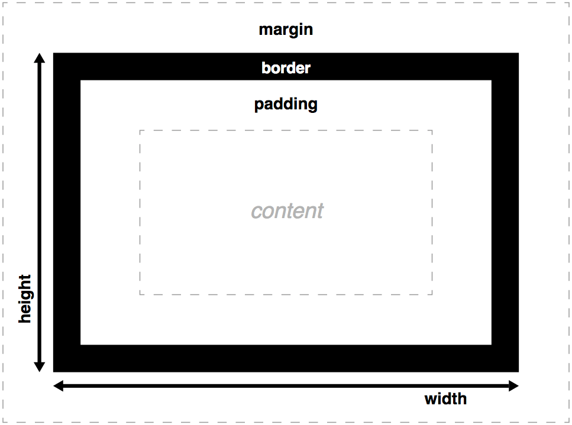

# Front-End Development Learning Guide
From Zero to Front-end Hero

Author Info
-----------
Author: Andrew Gurung <br>
URL: http://www.andrewgurung.com/

Context
-----------------
## CSS Basics from Mozilla Developer Network <br/>
https://developer.mozilla.org/en-US/docs/Learn/CSS/Introduction_to_CSS/How_CSS_works

[Assessment 1](assessment1)
[Assessment 2](assessment2)
[Assessment 3](assessment3)

Notes
-----
### Introduction to CSS

#### CSS basics
- A document is usually a text file structured using a markup language — `HTML`
- CSS is a language for specifying how documents are presented to users

**CSS consists of:**
- property: how to display the element
- selector: which elements to apply the properties to

**Simple CSS Syntax**

[JS Bin Example](https://jsbin.com/lapocar/edit?html,css,output)

HTML:
```
<!DOCTYPE html>
<html>
  <head>
    <meta charset="utf-8">
    <title>My CSS experiment</title>
    <link rel="stylesheet" href="style.css">
  </head>
  <body>
    <h1>Hello World!</h1>
    <p>This is my first CSS example</p>
  </body>
</html>
```

CSS:
```
h1 {
  color: blue;
  background-color: yellow;
  border: 1px solid black;
}

p {
  color: red;
}
```

#### How does CSS work


#### DOM
- DOM has a tree-like structure
- Each element, attribute and piece of text becomes a DOM node

#### Ways to apply CSS
1. External stylesheet
```
<head>
   <title>My CSS experiment</title>
   <link rel="stylesheet" href="style.css">
 </head>
```
2. Internal stylesheet
```
<head>
   <title>My CSS experiment</title>
   <style>
     p {
       color: red;
     }
   </style>
 </head>
```
3. Inline stylesheet
```
<body>
    <p style="color:red;">This is my first CSS example</p>
  </body>
```

#### CSS Vocabulary
CSS consists of two building blocks:
- property: Human-readable identifiers that indicates which stylistic feature to change
- value: How you want to change those stylistic features

```
Property + Value ==> CSS Declaration

CSS Declaration + Selectors ==> CSS Rulesets/Rules
```

- There are around 300 CSS properties

#### CSS Declaration block
- Enclosed in braces `{ }`
- Must end with semicolons
- Best practice: leave the last property with `;` too so that you don't forget
```
{
  background-color: red;
  color: blue
}
```

#### CSS At-rules and Nested Statements

CSS Rules are the most common blocks in CSS. But there are other blocks/statements too.
1. At-rules:
  - Used to convey metadata, nested or descriptive information
  - Starts with `@` sign, then followed by syntax, ending with `;`
  - Eg: `@import`(metadata), `@media`(nested), `@font-face`(descriptive)

2. Nested Statements:
  - Subset of At-rule
  - Syntax is a nested block of CSS which applies only if the condition is met
  ```
  @media(min-width: 800px) {
    body {
      color: red;
    }
  }
  ```

#### Making CSS readable
1. Whitespace
- Browsers ignores CSS whitespaces(tabs, spaces, new lines) as in HTML

2. Comment
- Comments in CSS begin with `/* and end with */`

3. Shorthand
```
padding-top: 10px;
padding-right: 15px;
padding-bottom: 15px;
padding-left: 5px;
```

Shorthand properties
```
/* in shorthand like padding and margin, the values are applied
   in the order top, right, bottom, left (the same order as an analog clock). There are also other
   shorthand types, for example two values, which set for example
   the padding for top/bottom, then left/right */
padding: 10px 15px 15px 5px;
```

#### Types of CSS selector
The following  types of CSS selectors are based on:
1. Simple selector: Element type, class or id
2. Attribute selector: Attributes/attribute values
3. Pseudo-classes: State an element exist in. Eg: Mouse hovered
4. Pseudo-elements: Relative to an element. Eg: First word of every paragraph
5. Combinators: Combining two or more selectors. Eg: Paragraphs that are direct descendants of divs
6. Multiple selectors: Multiple selectors share the same CSS rule separated by comma


#### Simple selectors
1. Element selector
- Selects an HTML element
- Case in-sensitive

HTML:
```
<div>CSS simple selctor</div>
```
CSS:
```
DIV {
  color: blue;
}
```  

2. Class selector
- '.' followed by class name
- Multiple elements can share same class name

HTML:
```
<li class="first done">Milk</li>
<li class="second done">Eggs</li>
```

CSS:
```
.done {
  text-decoration: line-through;
}
```

3. ID selector
- '#' followed by ID name of an element
- Most efficient way to select a single element

HTML:
```
<p id="polite"> — "Good morning."</p>
```

CSS:
```
#polite {
  font-family: cursive;
}
```

4. Universal selector
- `*`
- Rarely useful as it selects all elements

5. Combinators using simple selectors
- The descendant selector: (space) -- Select an element nested somewhere inside another element (not necessarily a direct descendant)
- The child selector: `>` -- Select an element that is an immediate child of another element.
- The adjacent sibling selector: `+` -— Select an element that is an immediate sibling of another element (i.e. right next to it, at the same level in the hierarchy).
- The general sibling selector: `~` —- allows you to select any elements that are siblings of another element (i.e. at the same level in the hierarchy, but not necessarily right next to it)

HTML:
```
<section>
  <h2>Heading 1</h2>
  <p>Paragraph 1</p>
  <p>Paragraph 2</p>
  <div>
    <h2>Heading 2</h2>
    <p>Paragraph 3</p>
    <p>Paragraph 4</p>
  </div>
</section>
```

CSS:
```
section p {
  color: blue;
}

section > p {
  background-color: yellow;
}

h2 + p {
  text-transform: UPPERCASE;
}

h2 ~ p {
  border: 1px dashed black;
}
```

[JSBin Practice](https://jsbin.com/kuyasu/2/edit?html,css,output)


#### Attribute selectors
1. Presence and value attribute selectors
- Tries to match exact attribute value

**Types:**
- [attr]: All matching attributes `attr`
- [attr="val"]: Matching attributes where `val` is the `attr`s value
- [attr~="val"]: Matching attribute where `val` is one of the comma separated list of `attr`s values

[JSBin Practice](https://jsbin.com/hajobuc/9/edit?html,css,output)

CSS:
```
[data-vegetable] {
  color: green;
}

[data-vegetable="liquid"] {
  background-color: goldenrod;
}

[data-vegetable~="chili"] {
  color: red;
}
```

2. Substring value attribute selectors
- Offer flexible matching in a similar fashion to regular expression

**Types:**
- [attr|="val"]: Attributes `attr` whose value is exactly `val` or starts with `val`
- [attr^="val"]: Attributes `attr` whose value starts with `val`
- [attr$="val"]: Attributes `attr` whose value ends with `val`
- [attr*="val"]: Attributes `attr` whose value contains `val`

[JSBin Practice](https://jsbin.com/mugeqer/7/edit?html,css,output)

CSS:
```
/* Classic usage for language selection */
[lang|=fr] {
  font-weight: bold;
}

[data-vegetable*="not spicy"] {
  color: green;
}

[data-quantity$="kg"] {
  font-weight: bold;
}

[data-quantity^="optional"] {
  opacity: 0.5;
}
```

#### Pseudo-classes
- Pseudo-classes are added to the end of a selector to style selected elements only when they are in certain state
- Syntax: colon (:) + keyword. Eg: :active, :checked

```
a:hover,
a:active,
a:focus {
  color: darkred;
  text-decoration: none;
}

li:nth-of-type(even) {
  background-color: #ccc;
}

li:nth-of-type(odd) {
  background-color: #eee;
}
```

#### Pseudo-elements
- Similar to Pseudo-classes
- Syntax: two colons (::) + keyword. Eg: ::after, ::before

[JSBin Practice](https://jsbin.com/hejarof/1/edit?html,css,output)
```
/* All elements with an attribute "href", which values
   start with "http", will be added an arrow after its
   content (to indicate it's an external link) */
[href^=http]::after {
  content: '!';
}

p::first-line {
  font-weight: bold;
}

 p::first-letter{
  font-size: 3em;
  border: 1px solid black;
  background: red;
  display: block;
  float: left;
  padding: 2px;
  margin-right: 4px;
}
```

#### Combinators
1. A, B:	Any element matching A and/or B
2. A B: 	Any element matching B that is a descendant of an element matching A (that is: a child, or a child of a child, etc.)
3. A > B:	Any element matching B that is a direct child of an element matching A
4. A + B:	Any element matching B that is the next sibling of an element matching A
5. A ~ B:	Any element matching B that is one of the next siblings of an element matching A

```
/* All <td>s that are a last child,
   within a <tbody>, within a <table> */
table tbody td:last-child {
  text-align: right
}

/* All <td>s preceded by a <th>, within a <table> */
table th + td {
  text-align: right;
}
```

#### Multiple selectors on one rule
- Multiple selectors separated by commas to apply same rule to different sets of elements at once

```
h1, h2, h3, h4, h5, h6 {
  font-family: helvetica, 'sans serif';
}
```

### CSS values and units

**Types of CSS values**
- Numeric values
- Percentages
- Colors
- Coordinate positions
- Functions

#### Numeric Values
- Pixels(px) are the most used `absolute` numeric values -- same size regardless of any other related settings
- mm, cm, in: Millimeters, centimeters, or inches. Absolute numeric values
- pt, pc: Points (1/72 of an inch) or picas (12 points.). Absolute numeric values

There are also relative units:
- em: 1em is 16 pixels for an element by default. The most common relative unit
- ex, ch: Respectively these are the height of a lower case x, and the width of the number 0
- rem: rem (root em) works in exactly the same way as the em, except that inherited font sizes will have no effect. Much better option than ems although rems don't work in older versions of IE
- vw, vh: Respectively these are 1/100th of the width of the viewport, and 1/100th of the height of the viewport

Unitless values:
1. Can be used to completely remove the margin or padding. Eg: padding: 0;
2. Line height multiplier. Eg: line-height: 1.5;
3. Number of animations. Eg: animation-iteration-count: 5;

Best practice: Using relative units is quite useful — you can size your HTML elements relative to your font or viewport size

#### Percentages
- Size will always shift to be a certain percentage of their parent container. Eg: width: 75%;

#### Colors
- Keywords: Oldest color types. Eg: red
- Hexadecimal values: (#) followed by six hexadecimal numbers. Eg: #ff0000
- RGB: A function of red, green and blue channel. Eg: rgb(0,0,255)
- HSL: A function of hue, saturation, and lightness. Eg: hsl(0,100%,50%);
- RGBA and HSLA: RGB and HSL function with an extra transparency parameter. Eg: rgba(255,0,0,0.5);

**Opacity**
- Another way to specify transparency via CSS.
`opacity: 0.5;`

#### Functions
- Name with parenthesis after it
```
/* calculate the new position of an element after it has been rotated by 45 degress */
transform: rotate(45deg);
/* calculate the new position of an element after it has been moved across 50px and down 60px */
transform: translate(50px, 60px);
/* calculate the computed value of 90% of the current width minus 15px */
width: calc(90%-15px);
/* fetch an image from the network to be used as a background image */
background-image: url('myimage.png');
```

### Cascade and inheritance
At its most basic level `Cascade` indicates that the order of CSS rules matter. But it depends on more factors:
1. Importance
2. Specificity
3. Source order

#### Importance
- Make sure it always wins over all others
- Syntax: !important
- Best practice: Don't use it unless you have to. Because `!important` changes the way the cascade normally works, it can make debugging CSS problems really hard to work out

```
.better {
  background-color: gray;
  border: none !important;
}
```

#### Specificity
- A measure of how specific a selector is

The amount of specificity a selector has is measured using four different values.
1. Thousands: Score one in this column if the matching selector is inside a <style> element or the declaration is inside a style attribute (such declarations don't have selectors, so their specificity is always simply 1000.) Otherwise 0.
2. Hundreds: Score one in this column for each ID selector contained inside the overall selector.
3. Tens: Score one in this column for each class selector, attribute selector, or pseudo-class contained inside the overall selector.
4. Ones: Score one in this column for each element selector or pseudo-element contained inside the overall selector.


#### Source order
- If multiple competing selectors have the same importance and specificity, source order comes in.
- Later rules will win over earlier rules.
Note: Rule overriding is on property level, not the entire ruleset.

### Inheritance
The idea is that some property values applied to an element will be inherited by that element's children, and some won't.
- Naturally inherited: Eg: font-family
- Naturally not-inherited: Eg: border, margin

CSS provides three special values to handle inheritance:
- inherit: Inherits its value from the parent element
- initial: Sets to the browser's default style sheet. If no value is set by browser, the property will be naturally inherited. i.e Set to `inherit`
- unset: If property is a naturally inherited property, it acts as `inherit` else acts as `initial`

```
body {
  color: green;
}

.inherit a {
  color: inherit;
}

.initial a {
  color: initial
}

.unset a {
  color: unset;
}
```

### The box model

- Every element within a document is structured as a rectangular box


#### Border box
- The total width of a box is the sum of its width, padding-right, padding-left, border-right, and border-left properties
- What if you want to have a box with a total width of 50% with border and padding


Solution: Use `box-sizing` property with `border-box` value
```
box-sizing: border-box;
```

### Advanced box manipulation
Beyond setting the width, height, border, padding and margin of boxes, there are some other properties available to change how they behave

#### Overflow
- When you set the size of a box with absolute values, the content may not fit the box which causes content overflow
The `overflow` property can have the following values
1. auto: Displays a scrollbar to accommodate the overflow content
2. hidden: Cuts off the overflow content
3. visible: Default browser behavior. Displays the overflow content outside of the box border without any scrollbar

[JSbin Practice](https://jsbin.com/haxefih/1/edit?html,css,output)

```
p {
  height: 100px;
  width: 200px;
  border: 1px solid black;
}

.autoscroll { overflow: auto;    }
.clipped    { overflow: hidden;  }
.default    { overflow: visible; }
```

#### Background clip
Background color and images are drawn under a box (In CSS every element is represented by a rectangular box)
- By default, backgrounds extend to the outer edge of a box's border
- What if you want to only limit the background within the content?
- `background-clip`: Adjust background settings on the box

1. border-box: Default browser behaviour. The background extends to the outside edge of the border (but underneath the border in z-ordering)
2. padding-box: No background is drawn below the border. (The background extends to the outside edge of the padding)
3. content-box: The background is painted within (clipped to) the content box

[JSBin Practice](https://jsbin.com/mabazor/1/edit?html,css,output)

```
.border-box { background-clip: border-box; }
.padding-box { background-clip: padding-box; }
.content-box { background-clip: content-box; }
```

#### Outline
- Outlines differ from borders
- It behaves like the border but is drawn on top of the box without changing the size of the box
```
outline: 1px solid white;
```

#### Types of CSS boxes
The type of box applied to an element is specified by the `display` property.
1. block:
- Stacked upon other boxes
- Content before and after the box appears on a separate line
- Can have width and height set on it
2. inline:
- Flows with the document text on the same line
- Width and height settings have no effect
- Any padding, margin and border set on inline boxes will update the position of surrounding text, but will not affect the position of surrounding block boxes
3. inline-block:
- Something in between the first two
- Inline characters: It flows with surrounding text without creating line breaks before and after it like an inline box.
- Block characters: It can be sized using width and height and maintains its block integrity like a block box — it won't be broken across paragraph lines.

[JSBin Practice](https://jsbin.com/hikabel/2/edit?html,css,output)
```
.inline       { display: inline;       }
.block        { display: block;        }
.inline-block { display: inline-block; }
```

### Debugging CSS
- CSS is permissive -- if a declaration is invalid, browser will ignore it completely and move ahead
- All modern web browsers provide developer tools to help inspect and understand web pages
- Any invalid properties appear with a line through them and a little warning symbol next to them
- Best practice: For a large stylesheet, it is worth running it through a W3C CSS Validation service first to get rid of any basic syntax mistakes
[W3C CSS Validation Service](http://jigsaw.w3.org/css-validator/)
-----------------------------------------

## Styling text
Styling text includes text styling fundamentals, including setting font, boldness, italics, line and letter spacing, drop shadows and other text features

### Fundamental text and font styling
The CSS properties used to style text falls into two categories:
1. Font styles: What font? How big? Bold or Italics?
2. Text layout styles: Space between lines and letters? Alignment?

[JSBin Practice](http://jsbin.com/dizijoh/14/edit?html,css,output)

#### Font styles
1. Color:
- Sets the foreground color
```
color: red;
```

2. Font-family:
- Applies the font to elements. If font is not found, browser sets default font
- There are certain fonts that are generally found across all systems known as `web safe fonts`. Eg: Arial, Courier New, Georgia, Times New Roman, Verdana
- Serifs are small decorative details on letters and symbols. Eg Times New Roman
- Sans serifs does not have these details. Eg Arial
```
font-family: arial;
```

**Note:** CSS defines five generic default names for fonts:  serif, sans-serif, monospace, cursive, and fantasy. `Default font` name will be open for interpretation by the browser which will try to replace it will the closet appropriate font face

- Font stack: Since the availability of a font is not guaranteed, it is best to define font stack. Best practice to define `default font` at the end.
```
font-family: "Trebuchet MS", Verdana, sans-serif;
```

3. Font-size: The most common sizes are
- pixels
- em: 1em = font size of parent element
- rem = font size of root element(i.e `<html>`) not the parent. More predictable than `em`

**Best Practice:** Set base `font-size` to 10px so that setting `em` or `rem` will be must easier to calculate instead of dividing my 16px(default size). `rem` is preferred over `em`

```
html {
  font-size: 10px;
}

h1 {
  font-size: 2.6rem; /* 26px */
}

p {
  font-size: 1.4rem; /* 14px */
}
```

4. Font style, font weight, text transform, and text decoration
- font-style: Values include `normal`, `italic`, `oblique` (Slant the normal font if italics version is not available)
- font-weight: Values include `normal`, `bold`, `lighter`, `bolder`, `100-900` (for fine grain control)
- text-transform: Values include `none`, `uppercase`, `lowercase`, `capitalize` (Capitalize first letter of every word)
- text-decoration: Values include `none`, `underline`, `overline`, `line-through`

5. Text drop shadows
- Takes four values which are horizontal offset, vertical offset, blur radius, shadow color
```
text-shadow: 4px 4px 5px red;
```

**Multiple shadows**
```
text-shadow: -1px -1px 1px #aaa,
             0px 4px 1px rgba(0,0,0,0.5),
             4px 4px 5px rgba(0,0,0,0.7),
             0px 0px 7px rgba(0,0,0,0.4);
```

#### Text layout styles
1. Text align: Values include `left`, `right`, `center`, `justify`
- Justify can look terrible, especially when applied to a paragraph with lots of long words in it. Use along with `hyphens` property (none, auto, manual) which inserts hyphen to break lines

```
text-align: center;
```

2. Line height: The height of each line
- Best Practice: Use 1.5-2 times `multiplier` instead of exact pixels. It calculates based on the font-size. Eg: 1.5 = 1.5 times of font-size.
```
line-height: 1.5;
```

3. Letter and word spacing
```
p::first-line {
  letter-spacing: 2px;
  word-spacing: 4px;
}
```

### Styling lists

#### List-specific styles
There are 3 properties that can be set to `<ul>` or `<ol>` elements
1. list-style-type: The type of bullets to use for the list, for example square or circle bullets
```
ol {
  list-style-type: upper-roman;
}
```

2. list-style-position: Whether the bullets appear inside or outside the list items
```
ol {
  list-style-position: inside;
}
```

3. list-style-image: Allows custom image as bullets
```
ul {
  list-style-image: url(star.svg);
}
```

For more flexibility use `background-image` solution:
```
ul li {
  padding-left: 2rem;
  list-style-type: none;
  background-image: url(star.svg);
  background-position: 0 0;
  background-size: 1.6rem 1.6rem;
  background-repeat: no-repeat;
}
```

#### List style shorthand
```
ul {
  list-style-type: square;
  list-style-image: url(example.png);
  list-style-position: inside;
}
```

Shorthand:
```
ul {
  list-style: square url(example.png) inside;
}
```

#### Controlling list count

[JSBin Practice](http://jsbin.com/norowu/1/edit?html,css,output)

1. start: What number to start from?
```
<ol start="4">
  <li>Apple</li>
  <li>Orange</li>
<ol>
```

2. reversed: Reverse the numbering
```
<ol reversed>
  <li>Apple</li>
  <li>Orange</li>
<ol>
```

3. value: Custom numbering
```
<ol>
  <li value="500">Apple</li>
  <li value="200">Orange</li>
<ol>
```

### Styling links
- Mnemonic: `L`o`V`e `F`ears `H``A`te

#### States of a link
1. Link: The default state. Unvisited state. `:link` pseudo class
2. Visited: A link when it has already been visited. `:visited` pseudo class
3. Focus: A link when it has been focused. `:focus` pseudo class
4. Hover: A link when it is being hovered over by a mouse. `:hover` pseudo class
5. Active: A link when it is being activated (e.g. clicked on). `:active` pseudo class

#### CSS properties to change default link styles:
- outline: An outline is a line that is drawn around elements (outside the borders) to make the element "stand out"
- color
- cursor: Change the hand icon when mouse over
- text-decoration: Use `none` to remove underline
- background: Give a background color that stands out
- border-bottom: Border-bottom is better than default `a href` underline which can cut across the descenders of letters like `g` and `y`

```
a {
  outline: none;
  text-decoration: none;
  padding: 2px 1px 0;
}

a:link {
  color: #265301;
}

a:visited {
  color: #437A16;
}

a:focus {
  border-bottom: 1px solid;
  background: #BAE498;
}

a:hover {
  border-bottom: 1px solid;     
  background: #CDFEAA;
}

a:active {
  background: #265301;
  color: #CDFEAA;
}
```

#### Including icons on link
Eg: Display icons on link only if it is an external link i.e begins with http

HTML
```
<a href="/contact">Contact Us</a> <br>
<a href="https://en.wikipedia.org/wiki/Weather">weather on Wikipedia</a>
```

CSS
```
a[href*="http"] {
 background: url('https://mdn.mozillademos.org/files/12982/external-link-52.png') no-repeat 100% 0;
 background-size: 16px 16px;
 padding-right: 20px;
}
```

#### Styling links as buttons

- `<li>` are blocks by default. So set `display` to `inline`
- `<a>` should be `block` that does not spill over the next line but we still want `<a>` to be in same line. Use `display: inline-block` that fulfills both requirements
- Set the width to 19.5%, and the margin-right to 0.625%. But the total will add up to 100.625%, which would make the last button overflow the <ul> and fall down to the next line. Removes the margin from last link `li:last-child a`

[JSBin Practice](http://jsbin.com/jarahic/edit?html,css,output)

HTML
```
<ul>
  <li><a href="#">Home</a></li><li><a href="#">Pizza</a></li><li><a href="#">Music</a></li><li><a href="#">Wombats</a></li><li><a href="#">Finland</a></li>
</ul>
```

CSS
```
body,html {
  margin: 0;
  font-family: sans-serif;
}

ul {
  padding: 0;
  width: 100%;
}


li {
  display: inline;
}

a {
  outline: none;
  text-decoration: none;
  width: 19.5%;
  display: inline-block;
  margin-right: 0.625%;
  line-height: 3;
  text-align: center;
  color: black;
}

li:last-child a {
  margin-right: 0;
}

a:link, a:visited, a:focus {
  background: yellow;
}

a:hover {
  background: orange;
}

a:active {
  background: red;
  color: white;
}
```

### Web fonts
There are only a limited set of `Web-safe fonts` -- available across all systems. But if the developer wants to use a custom font?
Web-safe fonts:
```
p {
  font-family: Helvetica, "Trebuchet MS", sans-serif;
}
```

#### Web fonts
- A CSS feature that allows you to specify font files to be ***downloaded*** along with your website as it is accessed
- Can get a bit complex to support different browsers. May have to support the following types
  - WOFF/WOFF2 (Web Open Font Format versions 1 and 2): the most efficient format around
  - EOT (Embedded Open Type) fonts: Older versions of IE only support
  - SVG version: Older versions of iPhone and Android browsers
- Generating required fonts for multiple browsers from a single font: https://www.fontsquirrel.com/tools/webfont-generator
- Using an online font service: [Google Fonts](https://fonts.google.com/)

**Web fonts syntax:**
- font-family: Any name to define the font
- src: location of font
- format: Optional parameter. Helps browser to locate a font they can use faster
- font-weight/font-style: If you are importing multiple weights of the same font, you can specify what their weight/style is

```
@font-face {
  font-family: 'ciclefina';
  src: url('fonts/cicle_fina-webfont.eot');
  src: url('fonts/cicle_fina-webfont.eot?#iefix') format('embedded-opentype'),
         url('fonts/cicle_fina-webfont.woff2') format('woff2'),
         url('fonts/cicle_fina-webfont.woff') format('woff'),
         url('fonts/cicle_fina-webfont.ttf') format('truetype'),
         url('fonts/cicle_fina-webfont.svg#ciclefina') format('svg');
  font-weight: normal;
  font-style: normal;
}

html {
  font-family: "myFront", serif;
}
```

-----------------------------------------

## Styling boxes

Box properties include:
- width/height of content box
- padding
- border
- margin

#### Percentage values
- Box height doesn't take percentages. It has to be exact values (Eg. Set in `em`, `px`)
- Border doesn't tale percentages
- Margin collapsing: When two boxes touches, the larger margin overrides the smaller

#### Overflow
- auto: If there is too much content, the overflowing content is hidden and scroll bars are shown to let the user scroll to see all the content.
- hidden: If there is too much content, the overflowing content is hidden.
- visible: If there is too much content, the overflowing content is shown outside of the box. Default behavior

#### Background clip
- Box background is made up of `background-color` and `background-image`
- Background extends upto the border which can be controlled by `background-clip`

Values for `background-clip`
1. border-box
2. padding-box
3. content-box

### Advanced box properties

#### Setting width and height properites
Ways of handling content box size -- setting constraints rather than absolute value using `max-width`, `max-height`, `min-width`, `min-height`

[JSBin Practice](http://jsbin.com/bokowin/6/edit?css,output)

```
width: 70%;
max-width: 1280px;
min-width: 480px;
```

Center align the content
```
margin: 0 auto;
```

Center align and constraint an image:
- `max-width`: Keeps the media (e.g. images and video) constrained inside a container
```
display: block;
margin: 0 auto;
max-width: 100%;
```

#### Changing the box model completely
- Total width of a box is the sum of its width, padding-right, padding-left, border-right, and border-left properties
- Setting box content size to 50% width will not be exact 50% after you add padding and borders
- To fix this, we can use `box-sizing: border-box` to have an all inclusive width

```
box-sizing: border-box;
```

#### Uncommon display types
- display: table -- allows you to emulate table layouts using non-table elements, without abusing table HTML to do so
- display: flex -- allows you to solve many classic layout problems such as laying a series of containers in flexible equal width columns, or vertically centering content
- display: grid -- gives CSS a native way of easily implementing grid systems

### Backgrounds
#### Background color
- Syntax: `background-color`
- Default color: `transparent`
- Best practice: Set background-color for failover mechanism to background image or newer background-gradient properties
```
background-color: yellow;
```

#### Background image
- Syntax: `background-image`
- Pass image path through `url` function
- background-image is used decoration without being parsed by screen readers. Must use `` element if the image is important
```
background-image: url(https://mdn.mozillademos.org/files/13026/fire-ball-icon.png);
```

#### Background repeat
- Syntax: `background-repeat`
- Possible values:
  1. no-repeat
  2. repeat-x
  3. repeat-y
```
background-repeat: no-repeat;
```

#### Background position
- Syntax: `background-position`
- Horizontal (x) and vertical (y) coordinates
- Possible values:
  1. Absolute values like pixels — for example background-position: 200px 25px.
  2. Relative values like rems — for example background-position: 20rem 2.5rem.
  3. Percentages — for example background-position: 90% 25%.
  4. Keywords — for example background-position: right center. These two values are intuitive, and can take values of left, center, right, and top, center, bottom, respectively.
```
background-position: 99% center;
```

#### Background image: gradient
- A linear gradient is created by passing in a `linear-gradient()` function as the value of a background-image property
- Three parameters
- Use keywords to specify the direction (to bottom, to right, to bottom right, etc.), or degree values (0deg is equivalent to top, 90deg is equivalent to to right, up to 360deg, which would be equivalent to to top again)
```
background-image: linear-gradient(to bottom, orange, yellow);
```
- Color stops: Color 20% of the top area with yellow-red gradient and color the rest 80% with red-orange gradient
```
background-image: linear-gradient(to bottom, yellow, red 20%, orange);
```

- Color stops: Top and bottom 20% gray, middle part should be white
```
background-image: linear-gradient(to bottom, rgba(0, 0, 0, 0.2), rgba(0,0,0,0) 20%, rgba(0,0,0,0) 80%, rgba(0, 0, 0, 0.2));
```

- Repeating gradient:
```
background-image: repeating-linear-gradient(to right, yellow, orange 25px, yellow 50px);
```

#### Background attachment
- Syntax: `background-attachment`
1. scroll: This fixes the background to the page viewport, so it will scroll as the page scrolls. Note we said viewport, not element — if you scroll the actual element the background is set on, not the page, the background won't scroll.
2. fixed: This fixes the background in position on the page, so it won't scroll as the page scrolls — it will stay in exactly the same position whether you scroll the page or the element the background is set on.
3. local: This value was added later on (it is only support in Internet Explorer 9+, whereas the others are supported in IE4+) because the scroll value is rather confusing and doesn't really do what you want in many cases. The local value fixes the background to the element it is set on, so when you scroll the element, the background scrolls with it.

[Example](https://mdn.github.io/learning-area/css/styling-boxes/backgrounds/background-attachment.html)


#### Background shorthand
- Any properties not specified in the shorthand will be assigned default properties
```
background: yellow linear-gradient(to bottom, yellow, #dddd00 50%, orange) no-repeat 99% center;
```

#### Multiple backgrounds
- Multiple backgrounds can be stacked separated by comma
- And the backgrounds are stacked on top of one another with the first appearing at the top, then the second below it, then the third, etc
```
background: url(https://mdn.mozillademos.org/files/13026/fire-ball-icon.png) no-repeat 99% center,
            linear-gradient(to bottom, yellow, orange);
```

Long hand:
```
background-image: url(image.png), url(background-tile.png);
background-repeat: no-repeat, repeat;
```

#### Background size
- Syntax: `background-size`
```
background-size: 16px 16px;
```

## Borders
Borders take the color of the text by default, and a width of 3px

- border-top, border-right, border-bottom, border-left: Set the thickness, style and color of one side of the border.
- border-width, border-style, border-color: Set only the thickness, style, or color individually, but for all four sides of the border.
- You can also set one of the three properties of a single side of the border individually, using border-top-width, border-top-style, border-top-color, etc.

Short-hand:
```
border: 2px solid red;
```

#### Border radius
- Syntax `border-radius`
- Used for rounded border
```
/* All corners*/
border-radius: 6px;

/* 1st value is top left and bottom right corners,
   2nd value is top right and bottom left  */
border-radius: 20px 10px;
/* 1st value is top left corner, 2nd value is top right
   and bottom left, 3rd value is bottom right  */
border-radius: 20px 10px 50px;
/* top left, top right, bottom right, bottom left */
border-radius: 20px 10px 50px 0;
```

#### Elliptical corners
- The two different radii are specified separated by a forward slash (/)

```
border-radius: 10px / 20px;
```

#### Border images
- Recent addition to CSS which makes it easier to achieve complex border patterns
- Syntax: `border-image` shorthand
- Use `background-clip` to make any background color only fill the area under the content and padding. i.e padding-box

[JSBin Practice](http://jsbin.com/xelawil/3/edit?html,css,output)

```
background-clip: padding-box;
border-image-source: url(https://mdn.mozillademos.org/files/13060/border-image.png);
border-image-slice: 40;
border-image-repeat: round;
```

1. border-image-source: `url()` function with filename
2. border-image-slice: For a 160x160px image with 4x4 grid, each slice will be 40px each. Hence value = 40.
If the image is a raster graphic (like a .png or .jpg), then the number will be interpreted in terms of pixels. If the image is a vector graphic (like a .svg), then the number will be interpreted as coordinates in the graphic
3. border-image-repeat:
- stretch: The default; the side images are stretched to fill the borders. This generally looks terrible and pixellated, so is not recommended.
- repeat: The side images are repeated until the borders are filled. Depending on circumstances, this might look ok, but you can get left with unsightly image fragments.
- round: The side images are repeated until the borders are filled, and they are all stretched slightly so that no fragments appear.
- space: The side images are repeated until the borders are filled, and a small amount of spacing is added between each copy such that no fragments appear.

## Styling tables

[JSBin Practice](http://jsbin.com/xejulid/3/edit?html,css,output)

### Spacing and layout
Default table styling is so cramped. This is the first thing to be styled

#### table-layout
- `table-layout: fixed`
- It will set a fixed width of columns which otherwise would be sized based on the content of the cell
- Hence we have to deal with each headings separately using `thead th:nth-child(n)` selector where n=column number
- Width can be can be set in percentage which sums to 100% making it responsive
- Padding on `th` and `td` will give some breathing room
- `caption-side: bottom` will place the caption at the table footer
Default table border will have space between them as below:


- `border-collapse: collapse` is preferred which collapses the borders into one line

#### Zebra effect
```
tbody tr:nth-child(odd) {
  background-color: #ff33cc;
}

tbody tr:nth-child(even) {
  background-color: #e495e4;
}
```

## Advanced box effects
[JSBin Practice](http://jsbin.com/rirekiv/2/edit?html,css,output)

#### Simple box shadow
- Parameters: Horizontal offset, vertical offset, blur radius, shadow color
```
.simple {
  box-shadow: 5px 5px 5px rgba(0,0,0,0.7);
}
```

#### Inner shadow
- Use `inset` keyword
```
box-shadow: inset 2px 2px 1px gray,
```

#### Multiple box shadow
```
.multiple {
  box-shadow: 5px 5px 5px black,
              10px 10px 5px red            
}
```

#### Filters
CSS provides a way to apply filters to an element
- drop-shadow() is a filter similar to `box-shadow` but more versatile. Instead of being limited to shadowing the box boundary, drop-shadow can be applied to a text inside of content box
- Note: Some browser may not finalized the implementation of filter. In such cases we can use Vendor prefix to use an experimental version of `filter` property

```
.filter {
  -webkit-filter: drop-shadow(5px 5px 1px gray);
  filter: drop-shadow(5px 5px 1px gray);
}

.box-shadow {
  box-shadow: 5px 5px 1px gray;
}
```

#### Blend modes
- CSS blend modes allow us to add blend modes to elements that specify a blending effect when two elements overlap

There are two properties that use blend modes in CSS:
1. background-blend-mode, which blends together multiple background images and colors set on a single element
```
background-blend-mode: multiply;
```
2. mix-blend-mode, which blends together the element it is set on with elements it is overlapping — both background and content
```
mix-blend-mode: multiply;
```

[Blend modes](https://mdn.github.io/learning-area/css/styling-boxes/advanced_box_effects/blend-modes.html)

#### -webkit-background-clip: text
- Allows you to clip background images to the shape of the element's text
```
-webkit-background-clip: text;
-webkit-text-fill-color: transparent;
```

[Cool Text](https://mdn.github.io/learning-area/css/styling-boxes/advanced_box_effects/background-clip-text.html)

-----------------------------------------

## CSS layout

## Introduction to CSS layout
CSS page layout techniques allow us to take elements contained in a web page and control where they are positioned

### Normal layout flow
- Normal flow is how the browser lays out HTML pages by default
- Displayed in the exact order in which it appears in source code
- The default behavior can be overriden with layout techniques -- `position`, `float`, `display` etc.

### Floats
- Rather than sitting on top of each other, `float` property allows elements to float to right or left
- Main uses are to layout columns and float text around an image
- Four possible values
  1. left: floats the element to the left
  2. right: floats the element to the right
  3. none: specifies no floating. Default value
  4. inherit: specifies the value of the float property to be inherited from the parent element

#### Making columns float
- Set `width` of column
- `float` one div with `left` and the other with `right` value

HTML
```
<div>
   <h2>First column</h2>
   <p> Lorem ipsum dolor sit amet, consectetur adipiscing elit. Nulla luctus aliquam dolor, eu lacinia lorem placerat vulputate. </p>
 </div>

 <div>
   <h2>Second column</h2>
   <p>Nam vulputate diam nec tempor bibendum. Donec luctus augue eget malesuada ultrices. Phasellus turpis est, posuere sit amet dapibus ut.</p>
 </div>
```

CSS
```
div:nth-of-type(1) {
  width: 48%;
  float: left;

}

div:nth-of-type(2) {
  width: 48%;
  float: right;
}
```

### Positioning Techniques
Four main types of positioning
1. Static positioning: Default behavior similar to Normal layout
2. Relative positioning: Modify an element's position on the page, moving it relative to its position in normal flow
3. Absolute positioning: Moves an element completely out of the page's normal layout flow, like it is sitting on its own separate layer. From there, you can fix it in a position relative to the edges of the page's <html> element (or it's nearest positioned ancestor element)
4. Fixed positioning: Similar to absolute positioning, except that it fixes an element relative to the browser viewport, not another element

[JSBin Practice](http://jsbin.com/pidugorape/1/edit?html,css,output)

#### Relative Positioning:
- Useful in making small tweaks in your layout such as moving an icon down a bit
- Syntax: `position: relative`
- Note: You also need to tweak `top` and `left` properties else the element will stay where it was
```
.positioned {
  position: relative;
  top: 30px;
  left: 30px;
}
```

#### Absolute Positioning
- Specify the distance the element should sit from the top and left sides of the page's boundaries (the <html> element, to be exact)
```
.positioned {
  position: absolute;
  top: 30px;
  left: 30px;
}
```

### CSS tables
- HTML table layout are inflexible, difficult to debug and semantically wrong
- CSS tables makes it easy to layout regular elements into tabular layout
- Eg: Used in HTML `<form>`s to align `<label>` and `<input>` elements
- `display` property with values such as `table`, `table-row`, `table-cell`, `table-caption`
- `caption-side` property to position caption

[JSBin Practice](http://jsbin.com/sukerivuke/2/edit?css,output)
```
form {
  display: table;
}

form div {
  display: table-row;
}

form label, form input {
  display: table-cell;
}

form p {
  display: table-caption;
  caption-side: bottom;
  font-style: italic;
}
```

### Flexible/Flex boxes
Flexible box (or flexbox) was invented to do what was pretty much impossible to achieve with regular CSS
- display: flex -- Tells the element's children to be laid out as flexible boxes to fill the available height of the parent, whatever that is, and be laid out in a row
- flex: 1 -- tells each element to take up an equal amount of the space available in the row, no matter how many there are

[JSBin Practice](http://jsbin.com/jihehunini/1/edit?html,css,output)

### Grid layout
- CSS Grids is the most experimental feature
- Not really supported anywhere yet except for experimental versions of Chrome and Firefox

-----------------------------------------

## Floats

### Introduction to floats
- Originally, the `float` property was introduced to allow web devs to float an image around a column of text as in a newspaper layout
- Later found out that `float` isn't limited to images
- Element with `float` property is taken out of normal layout flow and stuck to left-right hand side of parent container
- Any content that comes after the `floated` element will be wrapped around it
[JSBin Practice: A simple float example](http://jsbin.com/cikabujova/1/edit?css,output)

```
img {
  float: left;
  margin-right: 30px;
}
```

### Revisiting our drop cap example
[JSBin Practice: Drop cap example](http://jsbin.com/fepupudida/1/edit?css,output)
```
p::first-letter {
  font-size: 3em;
  border: 1px solid black;
  background: red;
  float: left;
  padding: 2px;
  margin-right: 4px;
}
```

### Multiple column floated layouts
- Floats are commonly used to create multiple column
- But they were not really intended for this job, and have some strange side effects

#### A three column layout
In the following example:
- We enclose `h2` and `p` within `div` to style the whole component easily
- By default, `h2`, and `div` are block elements so the example code would render elements stacked vertically as blocks
- To display `div` blocks side-by-side, we need to float these `div`s
- 36% + 30% + 4% + 26% = 96%, which leaves a 4% remainder to form a gutter between the second and third columns
- Best practice: Percentage widths are preferred for responsiveness

[JSBin Practice: Three column layout](http://jsbin.com/qalujix/4/edit?html,css,output)
HTML
```
<h1>2 column layout example</h1>
<div>
  <h2>First column</h2>
  <p> Lorem ipsum dolor sit amet, consectetur adipiscing elit. Nulla luctus aliquam dolor, eu lacinia lorem placerat vulputate. Duis felis orci, pulvinar id metus ut, rutrum luctus orci. Cras porttitor imperdiet nunc, at ultricies tellus laoreet sit amet. Sed auctor cursus massa at porta. </p>
</div>

<div>
  <h2>Second column</h2>
  <p>Nam vulputate diam nec tempor bibendum. Donec luctus augue eget malesuada ultrices. Phasellus turpis est, posuere sit amet dapibus ut, facilisis sed est. Nam id risus quis ante semper consectetur eget aliquam lorem. Vivamus tristique elit dolor, sed pretium metus suscipit vel. </p>
</div>

<div>
  <h2>First column</h2>
  <p> Lorem ipsum dolor sit amet, consectetur adipiscing elit. Nulla luctus aliquam dolor, eu lacinia lorem placerat vulputate. Duis felis orci, pulvinar id metus ut, rutrum luctus orci. Cras porttitor imperdiet nunc, at ultricies tellus laoreet sit amet. Sed auctor cursus massa at porta. </p>
</div>
```

CSS
```
body {
  width: 90%;
  max-width: 900px;
  margin: 0 auto;
}

div:nth-of-type(1) {
  width: 36%;
  float: left;
}

div:nth-of-type(2) {
  width: 30%;
  float: left;
  margin-left: 4%;
}

div:nth-of-type(3) {
  width: 26%;
  float: right;
}
```

Warning:
- If div2 and div3 are both floated right, the div2 will have higher priority and will be floated to the right most.
- HTML will be rendered as
`div1 div3 div2`

### Clearing floats
- Any content below the floats that isn't floated itself will wrap around the floated elements, which can start to look terrible
- Solution:  `clear:both` -- This element and those after it in the source will not float, unless you apply a new float declaration to another element later on
[JSBin Practice: Clear both example](http://jsbin.com/yohado/2/edit?css,output)

Clear can take three values:
1. left: Stop any active left floats
2. right: Stop any active right floats
3. both: Stop any active left and right floats

### Float problems
#### Problem #1: The whole width can be tricky to calculate
Simple 3 column layout works great with `float` until there are extra width introduced by the padding and the border. Then the three columns no longer fit on one line, so the third column drops below the other two.

#### Solution #1:
- box-sizing width = content + padding + border, not just content
- So adding padding and border will instead make the content narrower

```
* {
  box-sizing: border-box;
}
```

#### Problem #2: Add a 4% margin between floated 3 columns VS non-floating(clear:both) footer
- After applying `clear:both` to footer, it will be displayed on a new line but be pressed right up against the longest column
- `margin-top: 4%` will not work on footer
- You can't use margins on non-floated elements to create space between them and floated elements

#### Solution for #2:
1. Create a new div after the 3 columns
```
<div class="clearfix"></div>
```

2. Style clearfix to clear both
```
.clearfix {
  clear: both;
}
```

3. Footer margin-top will work now
[JSBin Practice: Float problem](http://jsbin.com/yohado/3/edit?css,output)

#### Problem #3: Background height of floated items
- Columns can be given a fixed height but only if the content are almost equal
```
.column {
  height: 550px;
}
```

- Solution: Setting the background color of the columns to the same as the background color of their parent, so you can't see that the heights are different. This is the best other option at the moment.

- Solution: Setting them to a fixed height and make the content scroll using overflow

- Solution: Using a technique called faux columns
- Flexbox was built to fix this problem.

## Positioning
Positioning allows you to take elements out of the normal document layout flow, and make them behave differently. Positioning is a fairly complex topic

### Document Flow
[JSBin Practice: Basic Document Flow](http://jsbin.com/xihofozapo/1/edit?html,css,output)
- Box model: Individual element boxes are rendered by taking the element's content, then adding padding, border and margin
- Block elements: Width = 100% of parent, Height = As tall as its content. Appears vertically separated by specified margin
- Inline elements: Width = As wide as its content, Height = As tall as its content. You **CANNOT** set width and height on inline elements. Appears on same line wrapped where overflowing text will move down to a new line
- Margin collapsing: If adjacent elements both have margins set on them, the larger will remain, and smaller disappears

### Introducing positioning
The whole idea of positioning is to override the basic document flow described above
Syntax: `position` property is used to make a specific type of positioning active on an element

#### Static positioning
[JSBin Practice: Static positioning](http://jsbin.com/xihofozapo/2/edit?html,css,output)
- Static positioning is the default positioning that **every** element gets
- Put the element in it's normal document layout flow. Nothing special
- Syntax `position: static`

#### Relative positioning
[JSBin Practice: Relative Positioning](http://jsbin.com/tapaxizebe/1/edit?html,css,output)
- Very similar to static positioning, except once an element is positioned using normal layout flow, you can modify its final position
- Syntax: `position: relative`. But just using relative positioning won't move an element
- Must be used alongside `top`, `bottom`, `left`, or `right` properties to move an element
- Shift behavior: Move an element in the direction based on `top`, `bottom`, `left`, or `right` values

#### Absolute positioning
[JSBin Practice: Absolute Positioning](http://jsbin.com/tapaxizebe/2/edit?html,css,output)
- An `absolute`ly positioned element will no longer occupy their original space in the normal document layout flow
- Any element that comes after an absolute element will take over its space
- Syntax `position: absolute`
- Start behavior: Element should start from `top`, `bottom`, `left`, or `right` values
- Eg: Setting `top: 0; bottom: 0; left: 0; right: 0; and margin: 0;` will stretch the element to cover the whole page

#### Positioning contexts
[JSBin Practice: Positioning contexts](http://jsbin.com/tapaxizebe/3/edit?html,css,output)
- By default, the "containing element" of an absolutely positioned element will be the `<html>` element
- In the previous example, even though `<body>` was the containing element of the absolutely positioned element, it ignored `<body>` and referenced the edge of the page -- referring `<html>` element
- This is more accurately called the element's **positioning context**
- Positioning context can be changed by giving **any** of the parent/ancestor element a `relative` position
```
body {
  position: relative;
}
```

#### Introducing z-index
[JSBin Practice: Positioning contexts](http://jsbin.com/tapaxizebe/4/edit?html,css,output)
- When multiple elements start to overlap, we need a priority of which elements appears on top
- By default, the element defined later will override the previous elements
- z-axis: An imaginary line that is perpendicular to the screen (3D)
- Positioned elements all have a z-index of auto, which is effectively 0
- Positioned element with greater `z-index` value will win
- Syntax: `z-index: 1`

#### Fixed positioning
[JSBin Practice: Positioning contexts](http://jsbin.com/tapaxizebe/5/edit?html,css,output)
- Similar to absolute positioning except that it is relative to the browser viewport
- Syntax: `position: fixed`
- Stick to top using `top: 0`
- Content appears to scroll up and disappear underneath it

#### Experimental: position sticky
- Syntax: `position: sticky`
- Still in experimental phase
- Hybrid between relative and fixed position
- Allows a positioned element to act like it is relatively positioned until it is scrolled to a certain threshold point (e.g. 10px from the top of the viewport), after which it becomes fixed

-----------------------------------------

## Practical positioning examples
### A tabbed info-box
HTML
```
<section class="info-box">
  <ul>
    <li><a href="#" class="active">Tab 1</a></li>
    ..
  </ul>
  <div class="panels">
    <article class="active-panel">
      <h2>The first tab</h2>
      <p>Lorem ipsum</p>
    </article>
    
    <article>
      <h2>The second tab</h2>
      <p>This tab hasn't got any Lorem Ipsum in it. But the content isn't very exciting all the same.</p>
    </article>
    
    <article>
      <h2>The third tab</h2>
      <p>And now an ordered list: how exciting!</p>
      <ol>
        <li>Nulla facilisi</li>
        ..
      </ol>
    </article>
  </div>
</section>
```

#### General setup
- box-sizing
- Get rid of default body margin
- Fixed tab height with info-box
```
html {
  font-family: sans-serif;
}

* {
  box-sizing: border-box;
}

body {
  margin: 0;
}

.info-box {
  width: 450px;
  height: 400px;
  margin: 0 auto;
}
```

#### Styling our tabs
[JSBin Practice: Styling our tabs](http://jsbin.com/jopewumoti/1/edit?html,css,output)
- Remove the default padding-left and margin-top from the unordered list
- `list-style-type` is set to `none` to get rid of the bullets
- `<a>` elements are set to display inline-block so they will sit in a line but still be stylable
- Set some styles on the link states
```
.info-box ul {
  padding-left: 0;
  margin-top: 0;
}

.info-box li {
  float: left;
  list-style-type: none;
  width: 150px;
}

.info-box li a {
  display: inline-block;
  text-decoration: none;
  width: 100%;
  line-height: 3;
  background-color: red;
  color: black;
  text-align: center;
}
```

#### Styling the panels
[JSBin Practice: Styling our panels](http://jsbin.com/jopewumoti/2/edit?html,css,output)
- Fit panels div inside parent element -- info-box
- Position all the panels to stack on top:0 and left:0 with background-white to hide the overlapping panels
- Set `active-panel` to z-index of 1
```
.info-box article {
  position: absolute;
  top: 0;
  left: 0;
  height: 352px;
  padding: 10px;
  color: white;
  background-color: #a60000;
}

.info-box .active-panel {
  z-index: 1;
}
```

#### Adding our JavaScript
[JSBin Practice: Adding our JavaScript](http://jsbin.com/jopewumoti/3/edit?html,css,output)
- Save references to all tabs and panels in `tabs` and `panels` variables
- Loop through all tabs and run setTabHandler() function
- setTableHandler() has onClick event
  - Loop through all tabs and remove all classes
  - Set class of active on the tab that was clicked on
  - Loop through all panels and remove all classes
  - Set active-panel on the panel that corresponds to the tab clicked
```
var tabs = document.querySelectorAll('.info-box li a');
var panels = document.querySelectorAll('.info-box article');

for(i = 0; i < tabs.length; i++) {
  var tab = tabs[i];
  setTabHandler(tab, i);
}

function setTabHandler(tab, tabPos) {
  tab.onclick = function() {
    for(i = 0; i < tabs.length; i++) {
      tabs[i].className = '';
    }

    tab.className = 'active';

    for(i = 0; i < panels.length; i++) {
      panels[i].className = '';
    }

    panels[tabPos].className = 'active-panel';
  }
}
```
## Flexbox
## Grids

-----------------------------------------
