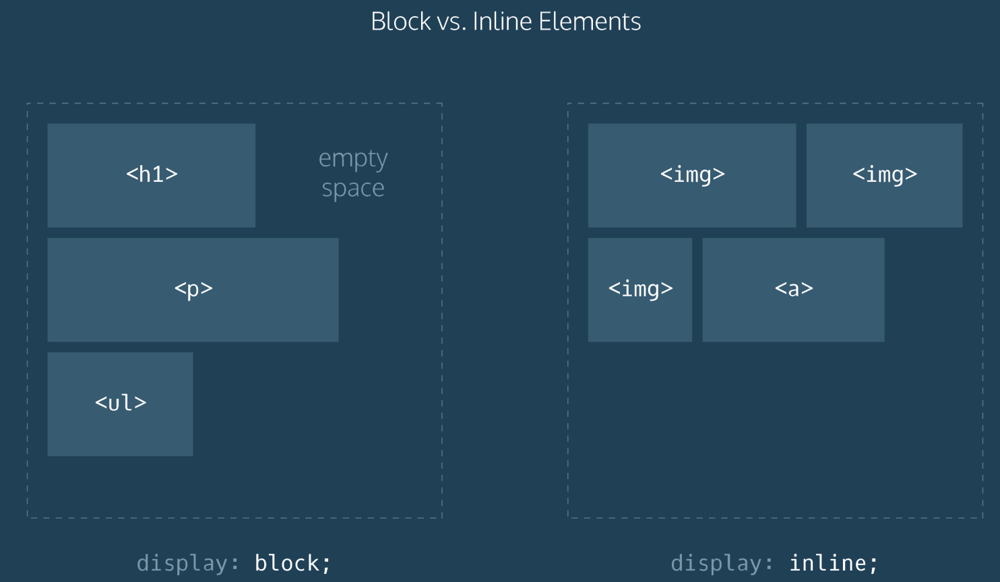
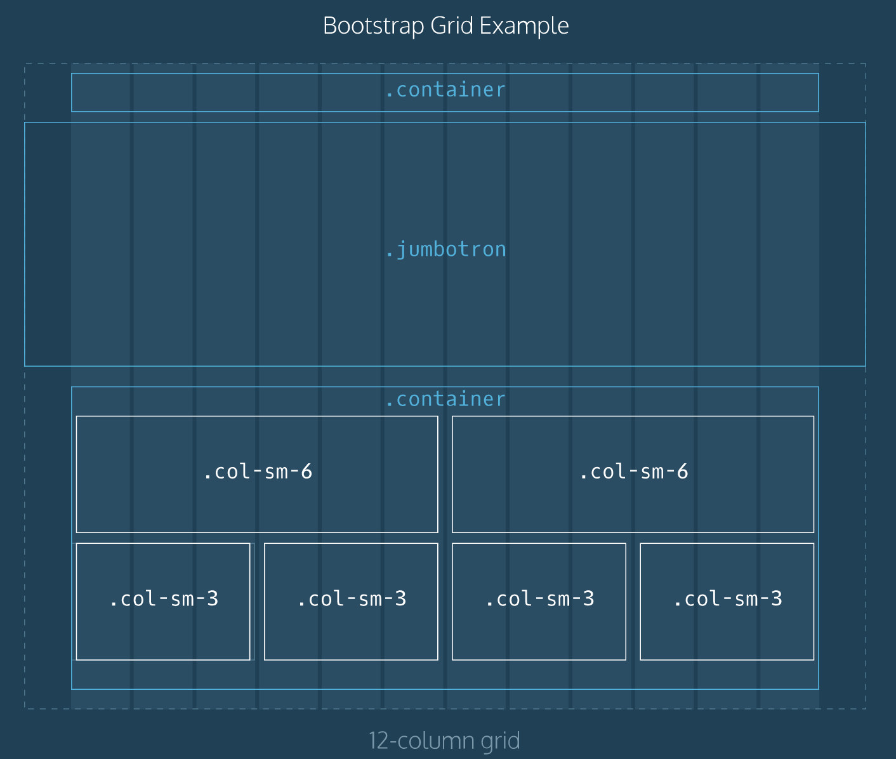

# Front-End Development Learning Guide
From Zero to Front-end Hero

Author Info
-----------
Author: Andrew Gurung
URL: http://www.andrewgurung.com/

Context
-----------------
## CodeAcademy: Make a Website
https://www.codecademy.com/learn/make-a-website

Notes
-----------------

## Site Structure
- HTML stands for Hyper Text Markup Language. It is used to give websites structure with text, links, images, and other fundamental elements
- CSS stands for Cascading Style Sheets. It is used to change the appearance of HTML elements
- There are six heading elements: h1, h2, h3, h4, h5, and h6
- Adding video
```
<video width="320" height="240" controls>
  <source src="video-url.mp4" type="video/mp4">
</video>
```
## A Closer Look at CSS
- CSS is a language used to style websites
- `<link rel="stylesheet" type="text/css" href="main.css"/>`

CSS can be divided into 3 parts:
1. rule: a list of CSS instructions for how to style a specific HTML element or group of HTML elements
2. selector: specifies exactly which HTML elements to style
3. properties and values: located inside the { } brackets, properties and values specify what aspect of the selector to style

- Changing font: `font-family: Palatino, 'Palatino Linotype', serif;`
- Background image" `background-image: url("image.jpg");`
- Background image color: `background-size: cover;`
- Ids have greater specificity than classes

## Boundaries and Space
- An important part of styling a webpage with CSS is organizing boundaries and space
- The box model consists of: content, padding, border and margin
- Border property consists of: thickness, type and color

- Display images in a row: `display: flex` on parent element
- Some of the gallery images are cut off. Fix: `flex-wrap: wrap` on parent element
- Center the gallery images: Fix: `justify-content: center` on parent element
- `position: relative`: You can then use it along with top, left, bottom, and right to shift an element away from where it would have normally appeared on the page

Eg: Simulate a button press by shifting it 2px down when it is pressed
```
.contact-btn a {
  position: relative;
}

.contact-btn a:active {
	top: 2px;
}
```

## Building with Bootstrap
- Bootstrap is a popular CSS framework with prewritten CSS rules designed to help you build webpages faster
- Add bootstrap in the `<head>` section
```
<link rel="stylesheet" href="https://maxcdn.bootstrapcdn.com/bootstrap/3.3.6/css/bootstrap.min.css"/>
```
- Bootstrap is popular because it offers `grids` -- 12 equal sized columns
- The words "container", "jumbotron", "col-sm-6" and "col-sm-3" refer to Bootstrap classes
- The element with class "jumbotron" spans the entire width of the webpage, beyond the borders of the grid.


### Simple header with navbar
Step 1: Create a header element with Bootstrap `container` class
```
<header class="container">
  ...
</header>
```

Step 2: Create a div with the Bootstrap class `row`
```
<header class="container">
  <div class="row">
  </div>
</header>
```

Step 3: Cut the row into two parts
```
<header class="container">
  <div class="row">
    <h1 class="col-sm-4">Skillfair</h1>
    <nav class="col-sm-8 text-right">
    </nav>
 </div>
</header>
```

Step 4: Create navigation items
```
<header class="container">
  <div class="row">
    <h1 class="col-sm-4">Skillfair</h1>
    <nav class="col-sm-8 text-right">
      <p>newest</p>
      <p>catalogue</p>
      <p>contact</p>
    </nav>
  </div>
</header>
```

### Jumbotron
- Many websites have a large showcase area featuring important content
```
<section class="jumbotron">
  <div class="container">
    <div class="row text-center">
       ...
    </div>
  </div>
</section>
```

### Button
The anchor element will have Bootstrap's btn btn-primary class, which will transform it into a button
```
<a class="btn btn-primary" href="#" role="button">See all</a>
```

### Content
1. First, an HTML section element with the container class is used:
```
<section class="container">
 ...
</section>
```

2. Next, div elements with the row class are added:
```
<section class="container">
  <div class="row">
  </div>
  <div class="row">
  </div>
</section>
```

3. Finally, the rows are divided by using divs with Bootstrap's col-sm-... class:
```
<section class="container">
  <div class="row">
    <div class="col-sm-6">
     ...
    </div>
    <div class="col-sm-6">
     ...
    </div>
  </div>
  <div class="row">
    <div class="col-sm-6">
     ...
    </div>
    <div class="col-sm-6">
     ...
    </div>
  </div>
</section>

```

Note: Using the col-sm-6 class ensures that this layout will appear when the user's screen is the width of a tablet device(768 pixels). On narrower screens, such as an iPhone, only one image per row will appear
